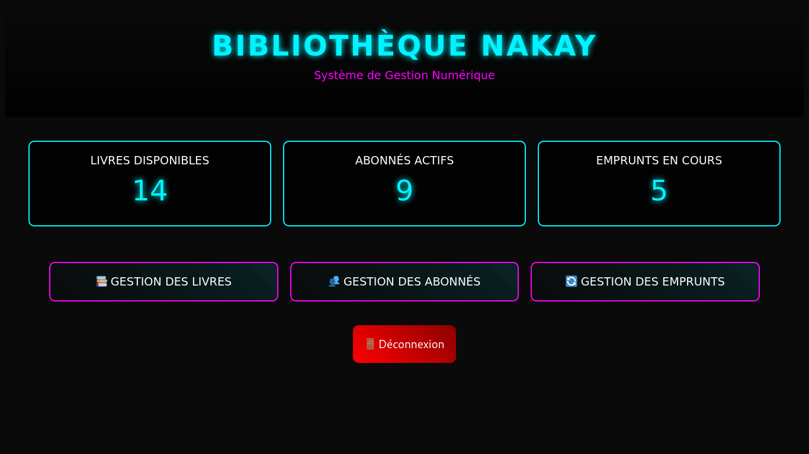
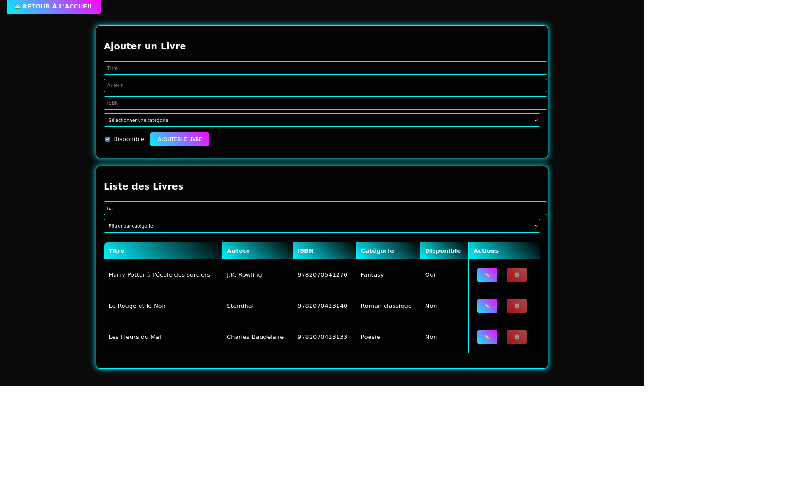
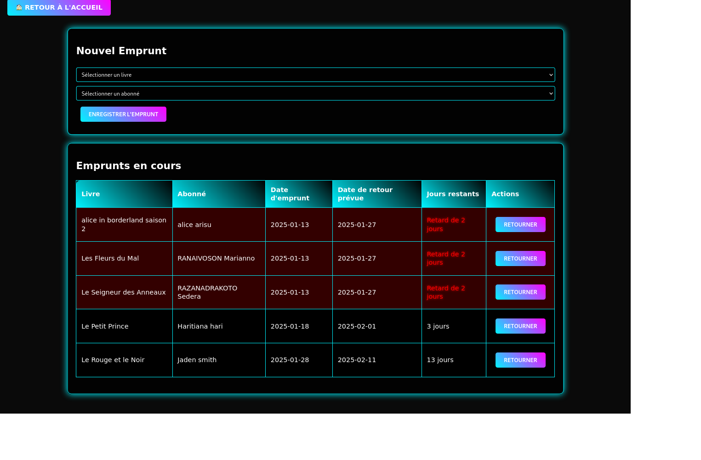

# 📚 Bibliothèque CyberNakay 🚀


**Système de gestion de bibliothèque futuriste** avec interface cyberpunk et fonctionnalités modernes.

## 🌟 Fonctionnalités

- 🎨 **Interface Cyberpunk** avec animations néon
- 📖 Gestion des livres (`CRUD complet`)
- 👥 Gestion des abonnés
- 🔄 Suivi des emprunts
- 🔒 Système d'authentification sécurisé
- 📱 Design responsive
- 📊 Tableau de bord statistique
- 🔎 Recherche intelligente
- 🚨 Notifications de retard

## 🛠 Technologies

- 
- 
- 
- 
- 

## 🎮 Démo

[](pas dispo)

## 🚀 Installation

1. Cloner le dépôt
```bash
git clone https://github.com/Nau-stack-110/biblio.git
```

2. Configurer la base de données
```sql
CREATE DATABASE bibliotheque;
USE bibliotheque;
SOURCE bibliotheque.sql;
```

3. Configurer les paramètres
```php
// includes/config.php
define('DB_HOST', 'localhost');
define('DB_USER', 'root');
define('DB_PASS', '');
define('DB_NAME', 'bibliotheque');
```

4. Lancer le serveur
```bash
php -S localhost:8000
```

## 🖼 Captures d'écran

|  |  |
|-----------------------------------------------|---------------------------------------------|
|            |           |

## 🔒 Sécurité

- 🔑 Hachage bcrypt
- 🛡 Protection CSRF
- 🔄 Sessions sécurisées
- 🚫 Injection SQL prévenue
- 🔒 Middleware d'authentification

## 📜 License

[MIT License](LICENSE) - © 2025 Biblio CyberNakay 

---

<div align="center">
  Made with ❤️ by [Naunau] | 
  (https://github.com/Nau-stack-110)
</div>